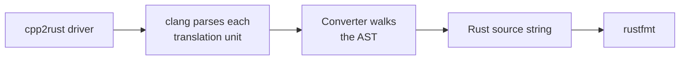

# Overview

The code generator is a clang tool. It parses the input with clang, walks the
resulting AST once, and appends Rust source text to a single string as it goes.
Translation is bottom-up: a node converts its children first and assembles its
own output from their text, so by the time a statement is emitted every
expression inside it has already been translated. There is no intermediate
representation of the output: every visited node writes its translation
directly, and the only post-processing is `rustfmt`.



The driver (`cpp2rust/cpp2rust.cpp`) runs the tool on a single file with
`--file` or on every file of a compilation database with `--dir`; either way all
translation units append to one output string, which is written to the `-o` path
and formatted with `rustfmt`.

The generator does not optimize its output. Every construct is translated the
same way regardless of context, which keeps the generator simple and its output
predictable; making the result faster or more idiomatic is left to later passes
over the Rust code.

## `Converter` and `ConverterRefCount`

The generator can produce two kinds of Rust from the same input, selected with
`--model`.

The unsafe model emits Rust that mirrors the C++ program directly: raw pointers,
`unsafe fn`, and calls into `libc`. It is used for debugging the translator and
for performance comparisons.

The refcount model, the default, emits safe Rust. Proving ownership and aliasing
statically is not possible for arbitrary C++, so the checks Rust would do at
compile time are moved to run time: every variable is reference counted and
every access is a dynamic borrow. The types that make this possible (`Value<T>`,
`Ptr<T>`, and the rest) live in the [runtime library](../runtime/overview.md).

Given

```cpp
int f() {
  int b = 2;
  int *p = &b;
  *p = 3;
  return b;
}
```

the unsafe model produces

```rust
pub unsafe fn f_0() -> i32 {
    let mut b: i32 = 2;
    let mut p: *mut i32 = &mut b as *mut i32;
    *p = 3;
    return b;
}
```

and the refcount model produces

```rust
pub fn f_0() -> i32 {
    let b: Value<i32> = Rc::new(RefCell::new(2));
    let p: Value<Ptr<i32>> = Rc::new(RefCell::new(b.as_pointer()));
    p.borrow().write(3);
    return *b.borrow();
}
```

In the code, `Converter` (`cpp2rust/converter/converter.h`) is the unsafe model:
a `clang::RecursiveASTVisitor` with a `Visit*` method for every C and C++
construct the tool supports. `ConverterRefCount`
(`cpp2rust/converter/models/converter_refcount.h`) is a subclass that overrides
the methods whose output differs and inherits the rest.

`ConverterRefCount` overrides every method that would emit raw pointers or
`unsafe` blocks, so its output is always safe Rust even though it derives from
the unsafe model. Because both models are driven by the same traversal, the
pages in this part describe each construct twice, once per model, and note when
a construct is handled entirely by the base class.

## What this part covers

[The Translation Pipeline](./pipeline.md) follows a source file from the driver
to the formatted output. The four parts after it follow the structure of the C++
program, from the outside in:

- [Types](./types.md): how every C++ type is spelled in Rust in each model, and
  the type-level constructs, records, enums, unions, bit-fields, pointers,
  casts, function pointers, lambdas, and the library types the converter
  special-cases.
- [Declarations](./declarations.md): functions, `main`, methods and
  constructors, local and global variables, and default values.
- [Statements](./statements.md): the translation unit, control flow, `switch`,
  `goto`, and `return`.
- [Expressions](./expressions.md): where the two models differ most; the
  [expression kinds](./expressions/kinds.md) and freshness that drive the
  refcount model, variable references, operators, calls, rule application,
  plugins, variadics, `printf` and streams, member access, construction, and
  what is not handled.

The last pages are for reading and changing the generator itself:
[Converter State](./internals/state.md) lists the member variables the visitors
communicate through, [The Mapper Interface](./internals/mapper.md) lists the
converter's interface to the translation rules, and
[Debugging the Generator](./internals/debugging.md) lists the logging,
assertions, and test workflow.
