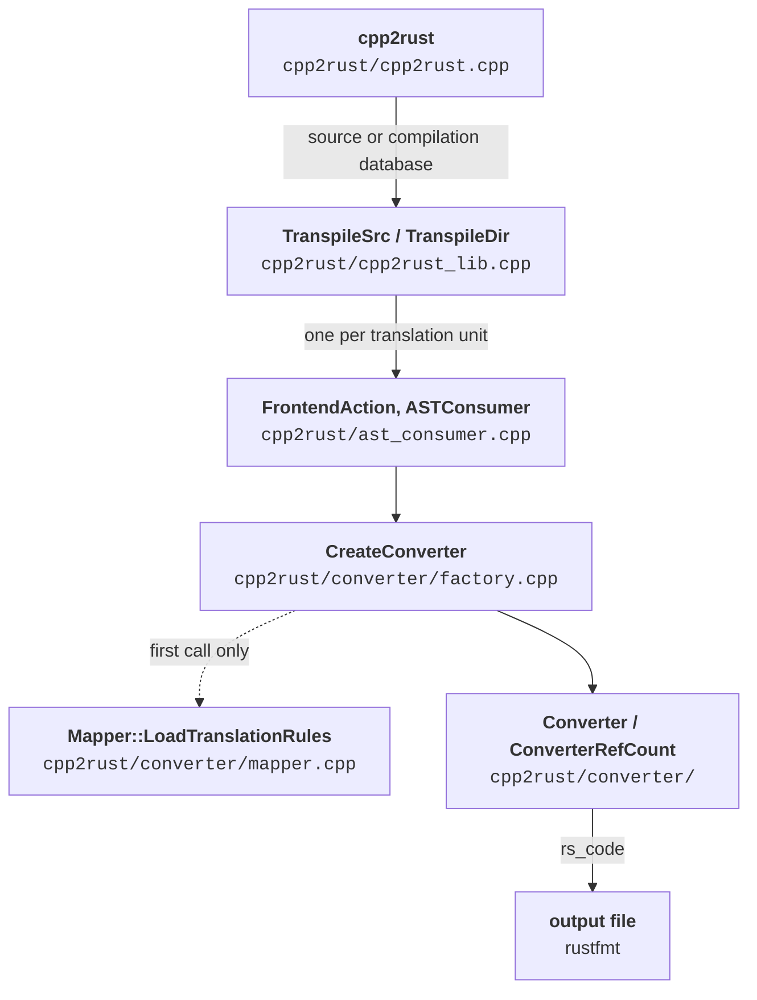

# The Translation Pipeline

## The stages

1. `cpp2rust` (`cpp2rust/cpp2rust.cpp`) parses the flags, resolves the rules
   directory (see
   [Loading and Matching](../rules/loading.md#finding-the-rules-directory)), and
   calls `TranspileSrc` for `--file` or `TranspileDir` for `--dir`.
2. `TranspileSrc` / `TranspileDir` (`cpp2rust/cpp2rust_lib.cpp`) run clang
   tooling over the source or over every file in `compile_commands.json`, with
   one `FrontendAction` per translation unit.
3. `ASTConsumer::HandleTranslationUnit` calls `CreateConverter`
   (`cpp2rust/converter/factory.cpp`), which loads the translation rules on its
   first call and constructs a `Converter` (`--model=unsafe`) or a
   `ConverterRefCount` (`--model=refcount`).
4. The converter emits the file preamble if this is the first unit, then
   traverses the unit and appends Rust text to `rs_code`.
5. The driver writes `rs_code` to the `-o` path and runs `rustfmt` on it.

## Gotchas

- Every unit is parsed with the platform flags from
  `cpp2rust/compat/platform_flags.h`, which put the
  [compat headers](../rules/compat.md) ahead of the system headers and set
  `-D_FORTIFY_SOURCE=0`, so macro-heavy libc APIs reach the converter as plain
  function calls.
- In `--dir` mode `__FILE__` is redefined to the file's basename, so the
  generated code does not embed the absolute paths of the build machine.
- Rules are loaded once per process, and the file preamble is emitted once, by
  the first unit; the bookkeeping that spans units (which declarations and
  records have already been emitted) is kept in `static` members of `Converter`.
- After the last unit, `Converter::EmitOpaqueRecords` appends `pub struct Name;`
  for every record type that was referenced but never defined, so types only
  used behind pointers still compile.
- A failing `rustfmt` is reported as an error, but the unformatted file stays on
  disk for inspection.
